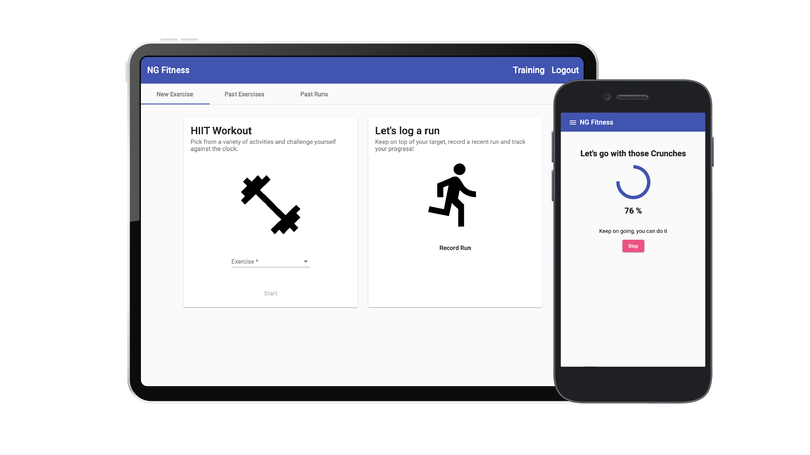

# FitnessTracker

## Project Overview

The fitness tracker is an application built using Angular 9, NgRX and Firebase, which enables a user to challenge themselves with daily workouts, record runs and track their progress. 
The application extends the project built through Udemy’s Angular course by Maximilian Schwarzmüller, which can be found [here](https://www.udemy.com/course/angular-full-app-with-angular-material-angularfire-ngrx/). 

### Install

1. Clone this repository
2. run npm install to install all project dependencies.

### Firebase Setup 

In order to run this application you will need to set up a firebase database to serve data to the application. 
Please follow the steps below:
1. Login or create an account at [Firebase](https://console.firebase.google.com/)
2. Add a ‘New Project’ and follow the set up steps.
3. Once set up, click the database tab, which can be found on the panel to the left. 
4. Create a ‘Cloud Firestore’ database and start in test mode.
5. Set the location for where your Cloud Firestore data will be stored.
6. Once the database has successfully been created you will need to create an initial collection which will store the different exercises the user can choose from. Click ‘‘Start New Collection’ and name it availableExercises. 
7. A dialog box will pop up, allowing you to add an item into the collection. You can add as many or as little exercise items, just be sure to follow the format below for each.
> Auto generate the ID

> Add 3 fields 
1. { name : calories, type: number, value: 12 }
2. { name: duration, type: number, value: 120 }
3. { name: name, type: string, value: 'burpees' }
> Please note you may change the value for each field to represent a different exercise but make sure to add all 3 fields for each exercise added as well as 
corresponding types as this will need to match the exercise interface defined within the project. 

#### Add Firebase Config to environment.ts

Once complete you will need to add the Firebase Configuration to the environment.ts file. 
To do this, click the ‘Project Settings’ Icon in the left hand panel. Under ‘General’ you will find the configuration var firebaseConfig = {......}.
Add this to the environment.ts file in the space provided.

###Firebase Authentication

This project requires Firebase authentication in order to enable users to sign up, login and logout.
To enable Firebase authentication to work in this application click the Authentication tab in your firebase console and enable email/password

###Google Maps  

In order to access and use the maps component provided with Angular 9 you will need to provide a Google Maps JavaScript API key. Please follow the instructions provided [here](https://developers.google.com/maps/documentation/javascript/get-api-key). to generate an API key. 
Add the key to the index.html file in place of [INSERT API KEY] in the script tag at the bottom of the file. 

### Run

To run the the application run `ng serve`.
With the server running visit: `http://localhost:4200`

This project was generated with [Angular CLI](https://github.com/angular/angular-cli) version 9.1.1.
